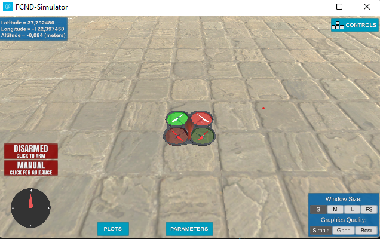
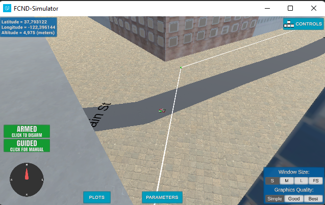

## Project: 3D Motion Planning


---


# Required Steps for a Passing Submission:
1. Load the 2.5D map in the colliders.csv file describing the environment.
2. Discretize the environment into a grid or graph representation.
3. Define the start and goal locations.
4. Perform a search using A* or other search algorithm.
5. Use a collinearity test or ray tracing method (like Bresenham) to remove unnecessary waypoints.
6. Return waypoints in local ECEF coordinates (format for `self.all_waypoints` is [N, E, altitude, heading], where the drone’s start location corresponds to [0, 0, 0, 0].
7. Write it up.
8. Congratulations!  Your Done!

## [Rubric](https://review.udacity.com/#!/rubrics/1534/view) Points
### Here I will consider the rubric points individually and describe how I addressed each point in my implementation.  

---
### Writeup / README

#### 1. Provide a Writeup / README that includes all the rubric points and how you addressed each one.  You can submit your writeup as markdown or pdf.  

You're reading it! Below I describe how I addressed each rubric point and where in my code each point is handled.

### Explain the Starter Code

#### 1. Explain the functionality of what's provided in `motion_planning.py` and `planning_utils.py`

Unlike backyard_flyer_solution.py, which transitions from arming to takeoff, motion_planning.py introduces a new state called PLANNING. This state is used to calculate a path before the drone takes off. The planning phase includes reading obstacle data, generating a grid, finding a path using the A* algorithm, and converting this path into waypoints.

The state transitions in motion_planning.py are modified to accommodate the planning phase. After arming, the drone transitions to the PLANNING state (motion_planning.py:129), where it calculates the flight path. It does this by selecting an arbitrary point within a grid that does not has obstacle (motion_planning.py:214) After planning drone proceed to takeoff, following the waypoints generated from the A* path (motion_planning.py:232) which are then pruned (motion_planning.py:240) by checking colinearity (I came up with nice recursive implementation motion_planning.py:41-62)).

An additional method, send_waypoints, is used to send the calculated waypoints to the simulator. This is primarily for visualization purposes, allowing the user to see the planned path in the simulation environment.

### Implementing Your Path Planning Algorithm

#### 1. Set your global home position
Here the first line of the colliders.csv matches the point where drone is spawned as seen on the picture (so the drone spawns in (0,0) local coordinates):



First line of csv:
```
lat0 37.792480, lon0 -122.397450
```

I use self.set_home_position() in line 196 to set home position after reading the first line from the file.

#### 2. Set your current local position
Local position is calculated using global_to_local method. Becuase we spawn drone at the home position local coordinates are (0,0), line 196.

#### 3. Set grid start position from local position
It works. To figure out our position on the grid we need to subtract offsets, line 208.

#### 4. Set grid goal position from geodetic coords
To make things easier I just picked the point from the map where I want to travel  (-122.395009, 37.790436). Then convert them to map coordinates the same very way as we did with grid_start so converting from global to local and then subtracting offsets.
I also have a commented code that draws random position from the map.

#### 5. Modify A* to include diagonal motion (or replace A* altogether)
I wrote my own fast implementation using heapq that is a very fast queue based on trees with log(n) operations.

#### 6. Cull waypoints 
I came up with colinearity test based on triangle area test. Implementation is a recursive algorithm that has complexity of O(n) where n is a path length. Works as good as a non recursive but I like the implementation more.

### Execute the flight
#### 1. Does it work?
It works!



### Double check that you've met specifications for each of the [rubric](https://review.udacity.com/#!/rubrics/1534/view) points.
  
# Extra Challenges: Real World Planning

For an extra challenge, consider implementing some of the techniques described in the "Real World Planning" lesson. You could try implementing a vehicle model to take dynamic constraints into account, or implement a replanning method to invoke if you get off course or encounter unexpected obstacles.


